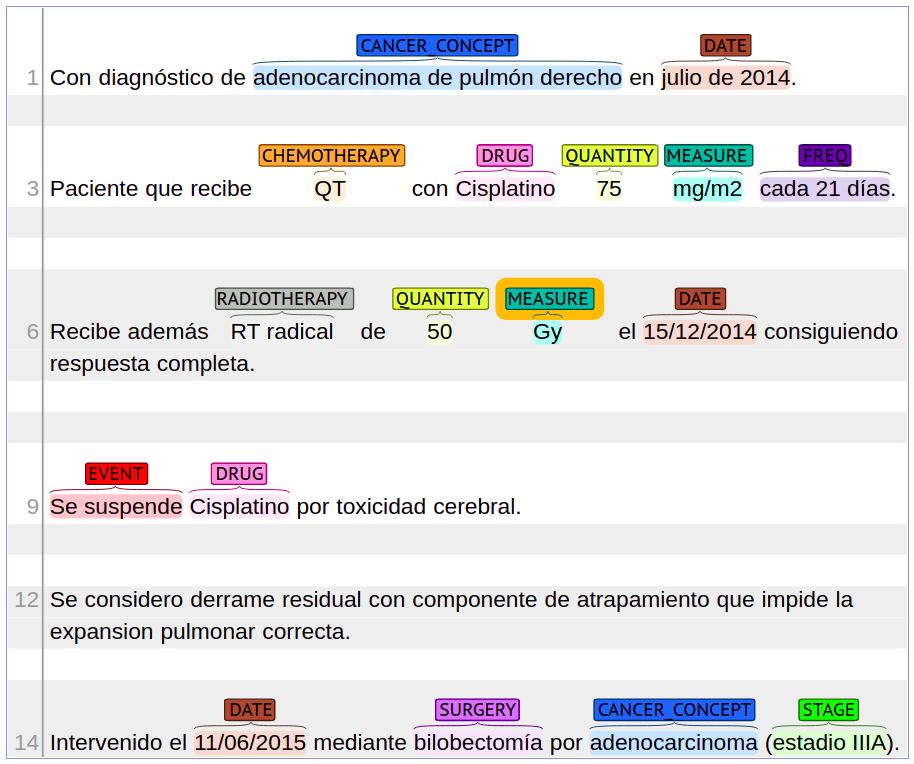

<h2> Extracting Cancer Treatments from clinical notes written in Spanish</h2>
This repository contains a neural model trained to extract cancer treatments from clinical notes written in Spanish. The model is based on a Bidirectional Long Short Memory (BiLSTM) neural net with a Conditional Random Field (CRF) layer.  

This model perform Named Entity Recognition (NER) using an annotated corpus from clinical notes of lung cancer patients.    

Next figure shows an example of  annotated sentences with cancer treatments:

  

   

<H3>Repository Files</H3>
 
This repository contains the next directories:

<ul>
    <li><strong>BILSTM:</strong>   This directory contains an implementation of the  BiLSTM-CRF model. This code is use to train the model.</li> 
    <li><strong>Trained:</strong> This directory contains a trained BILSTM-CRF (saved) model used to an instance to perform NER. </li>    
         
  </ul>
